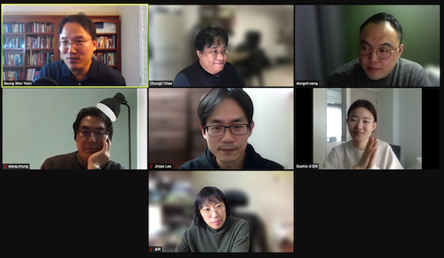

# Session1 - Chapter1 & 2
## 발표자료
- Python
    - [채충일 발표자료](https://drive.google.com/file/d/1YXzvYAqYfOlsTKB6k1K0GBP6RCqTRr-S/view?usp=sharing)
- R
    - [Chapter 1: Welcome to R](http://r-marketing.r-forge.r-project.org/Instructor/Chapter1/Chapter1-ChapmanFeit.html#/)
    - [Chapter 2: Basics of the R Language](http://r-marketing.r-forge.r-project.org/Instructor/Chapter2/Chapter2-ChapmanFeit.html#/)

## 요약
- 자기소개
    - 개발, 분석, 인사 등등 다양한 백그라운드
    - 이번 스터디에 참가한 동기
        - 개발에 있어서 통계쪽 역량을 높이고 싶어서
        - 관련 실무자들이 어떤 일을 하고 있으며 어떤 관심을 갖고있는지에 대한 서칭
        - 스터디를 통해 분석에 대한 일반적인 역량을 높이고 싶음
    - 스터디 참가자 대부분이 이과계열 ^^;
- 챕터요약
    - 채충일
        - 파이썬 소개와 기본환경에 대한 소개
        - 스터디에 필요한 리소스 소개
    - 윤승원
        - R 소개와 기본환경 소개
- 스터디진행관련
    - 가르치고 강의하는것이 아니고
    - 스터디한것을 공유하며 디스커션하는데 중점
- 2명정도 결원이 생겨 보충할 예정

## 현장사진
