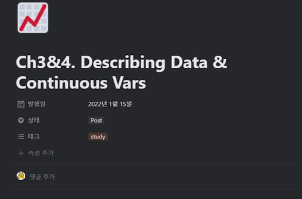

# Session1 - Chapter1 & 2
손경희

## 발표자료
- [노션](https://www.notion.so/Ch3-4-Describing-Data-Continuous-Vars-f074b5ea4b7849b69c14a65d04f8aeeb)
- [PDF](https://drive.google.com/file/d/1EC1y9vQwPwn-uGACFh5XblTW_ENIFtPE/view?usp=sharing)

## 요약
- 체크인 질문: 지난한주를 다섯글자로 표현하고 그 이유를 설명
	- 중장기계획, 너무바빳음, 롤러코스터, 지옥과천국, 백신맞은주, 샤이니만세, 휴가후여파, 티끌모아태산, 이럴줄알았(다), 새해엔다들
- 챕터요약: 발표자료 참조
- 디스커션
	- 시뮬레이션: R이 없는 데이터를 잘 채워넣어준다
	- Factor - 유용성, 더미코딩
	- 랜덤제너레이션에서 시간스템프를 사용
	- 마케팅 데이터가 Transformation을 자주하더라 실무적으로 유용할것 같다
	- 분포와 샘플링 중요
	- 내 업무에서는 어떤 데이터, 어떤 분포의 데이터를 주로?
	- 데이터 전처리의 중요성
	- Box-Cox변환 https://m.blog.naver.com/jiehyunkim/220616091027
	- 회원등급과 행동의 상관관계 
	- 실무에서의 접근 시작점 (이 물건을 어떻게 팔아야 할 것인가)
	- 현상은 동일하지만 목적에 따라(산업) 필요한 데이터가 달라짐
	- 일본사례 이탈자분석 (2014년) https://gamebiz.jp/news/131227
	- [R graph gallery](https://www.r-graph-gallery.com/)
	- [Python graph gallery](https://www.python-graph-gallery.com/)
	- [Sunburst chart](https://plotly.com/r/sunburst-charts/)

## 현장사진

