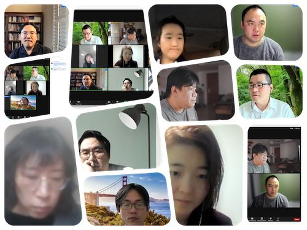

# Session - Chapter9: Additional Linear Modeling

박규서

## 발표자료

-   [진행안내](https://docs.google.com/document/d/18rNA__Gh9AJj_tocM5q2dS7fYaBrH9Dg/edit?usp=sharing&ouid=106329859225085774367&rtpof=true&sd=true)
-   [챕터요약](https://docs.google.com/document/d/1vlHCXo9tuewkMlkctStiPeK8XxbVbmVV/edit?usp=sharing&ouid=106329859225085774367&rtpof=true&sd=true)
-   [위계적
    선형모형](https://drive.google.com/file/d/1QemmYle-YZAru3Aok_uw7kYoPWBa56Bc/view?usp=sharing)
-   [An introduction to hierarchical linear
    modeling](https://drive.google.com/file/d/196NSVcpTvyMtVGwmI9rvr54fpfLBYrtp/view?usp=sharing)

## 요약

Check-In (15분) : 올해도 벌써 1달이 지났고 2월입니다. 올 해 새롭게
시작하신 것이나 재미있는 계획이 있으신지요?

-   강동오 : 올 해에는 책 집필 및 출판을 목표로 삼고 있구요, 영어로 일
    잘하기 목표도 있습니다.
-   박규서 : 올 한해는 제 분야와 연계하여 인공지능과 관련된 논문이나
    보고서를 한편 작성해 보고자 합니다.
-   손경희 : 손바닥만한 방에 옹기종기 일하던 1년이 지나 사무실을 넓혀서
    4월에 이사가요! 오늘 결혼 4주년 기념사진을 찍기로 했어요 (5분만 먼저
    나가볼게용ㅠ♡)
-   윤승원 : 100 mile run every month. Studying Bayesian, Time series,
    GLM. Finishing 1\~2 industry projects, meeting with former AHRD
    presidents
-   이승희 : 무의식의 세계 강화 통한 쎈멘탈 만들기 + 예전 동료와 공동
    프로젝트
-   이진재 : 새로운 업무 잘 진행. 기계학습/영어 레벨 향상. 분석 강의
-   정시앙 :비즈니스에 임팩트를 줄 수 있는 ML모델 및 분석
-   채충일 : 건강, 앱개발(샤이니/대쉬), 재미있는연구

## 현장사진

