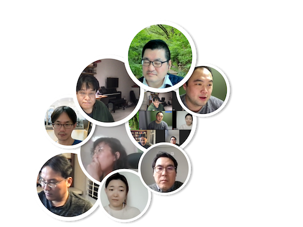

# Session - Chapter 10: Confirmatory Factor Analysis and Structural Equation Modeling
채충일

## 발표자료
- [챕터요약](https://drive.google.com/file/d/1PiIO6BcflSLQiySTeHYb8SAiTOCPccIJ/view?usp=sharing)
- [코드](https://drive.google.com/file/d/1V4Csi6cUBVp20k7zrtUNe0Vl9k0SOIdT/view?usp=sharing)

## 현장사진

