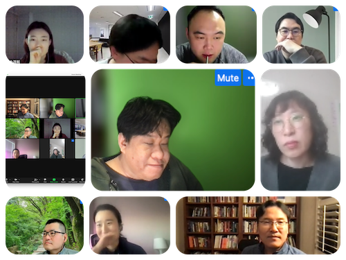

# Session - Chapter 11: Segmentation: Clustering and Classification

강동오

## 발표자료

-   <https://drive.google.com/file/d/1z0OOVQXOv4IQfoh87cLaQETtxnQYBPzb/view?usp=sharing>

## 요약

각자가 온라인 쇼핑몰을 운영하고 있다고 가정했을때, 본인 스스로를 타게팅
하려면 어떤 Segment를 설정해야 될 지 작성해 주세요.\^\^

-   강동오: 30대 남성, 평균 2021년 누적 방문수 24회(월 평균 2회),
    생활용품 카테고리를 주로 구매, 평균 방문시 구매액 5만원 -
    이진재:40대/남성/월방문수10회/구매액5만원/생활용품,전자기기 에서
    주로 접속 / 카트에 일단 물건을 넣어둠 / 멤버쉽 회원 아님
-   이승희: 40대 워킹맘, 식품/생활용품, 매일 방문, 장바구니 체류시간 김,
    주 5만원\*2회, 목요일 구매 빈도 높음 / 패션,잡화 : 주3회 방문, 저녁
    시간대, 링크 공유 일정 시간 후 구매 경향, 특정 브랜드 충성도 높음 -
    워킹맘: 기초조사를 통한 행동유형을 규정(배송비 고민없이 등) / 팬데믹
    이후: ??, 유저 조사로 정답 정보를 받아서 → 추정모델을 만들어서
    활용(논란은 언제나...)
-   Eunice Seo: grocery, home improvement product shopping, shopping
    frequency more than once a week, total spendings over \$500/month -
    미국에서 연령자체를 보지 않음: Life style, behavior에 따른 분류를
    주로 함
-   손경희:30대여성.기혼.생활용품,간편식품주1회이상구매.구매액월 80만원
    내외. TVING, 웹툰 등 컨텐츠 구매. 네이버페이. 모바일 결제.
-   정시앙: 건강, 종합쇼핑몰, 금융 관련 카테고리 앱 설치, android OS -
    앱 설치 카테고리에 따라 많은 정보를 얻을 수 있음, 갈수록 힘들어짐
-   박규서 50대, 남성, 방문수 월20회, 책, 전자기기, 사무용품, 기타항목
    구매, 평균방문시 2만원 \~5만원 (물폼에 따라 차이, 전자기기는 비쌈):
-   채충일: 40대, 남성, 월 누적방문 30회 주 3회, 전자기기, 사무용품
    카테고리, 평균 방문시 구매액 20만원(구매성사 주로 월초), 핸드폰에서
    주로 접속
-   윤승원: 50대, 남성, visit by month 5, all in the morning, shoes,
    clothes, saving until free shipping (\$100), laptop access, viewing
    reviews, watching lots of prime movies

## 현장사진

