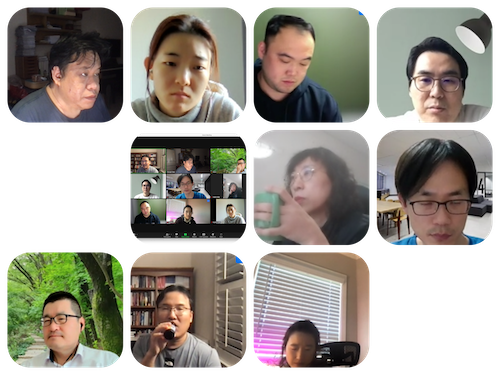

# Session - Chapter 12 & 13: Association Rules for Market Basket Analysis / Choice Modeling

정시앙

## 발표자료

-   <https://drive.google.com/file/d/1AOJzB-vTEaDy8iBAZJxbPhVSpazagEjw/view?usp=sharing>

## 요약

Association 어느 정도 알고 계신가요?
(aprioi 알고리즘, lift, support,confidence 척도).
업무에 활용해본 경험도 있는지도 궁금합니다.

-   강동오: 실제 사용한 경험은 없습니다.
-   이진재: 실제 업무에서는 사용해 본적은 없습니다.
-   이승희: 사용 경험이 없습니다. - Eunice Seo:.
-   손경희: 사용 경험 없습니다.
-   정시앙: association 알고리즘에 대해 들어본 적이 있고, 실제 활용해본 적은 없습니다.
-   박규서: 사용해 보지는 않은 것 같습니다.
-   채충일: 실제 프로젝트에서 활용경험이 있습니다(네트워크 키워드들의 association). 수업으로도 가르쳐본적도 있습니다
-   윤승원: Used it before as part of learning & research, understand rationale and process fine, plan to apply to research soon (learners' or employees' use of resources, or two mode network)

## 현장사진

